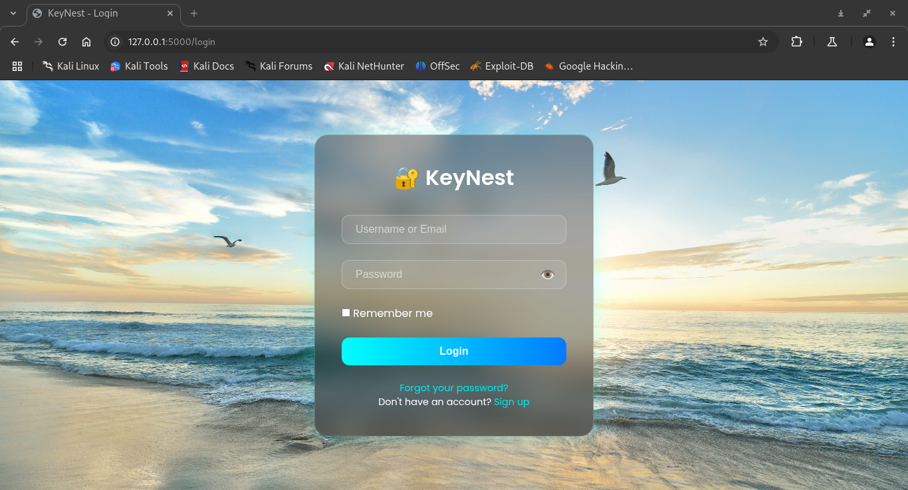
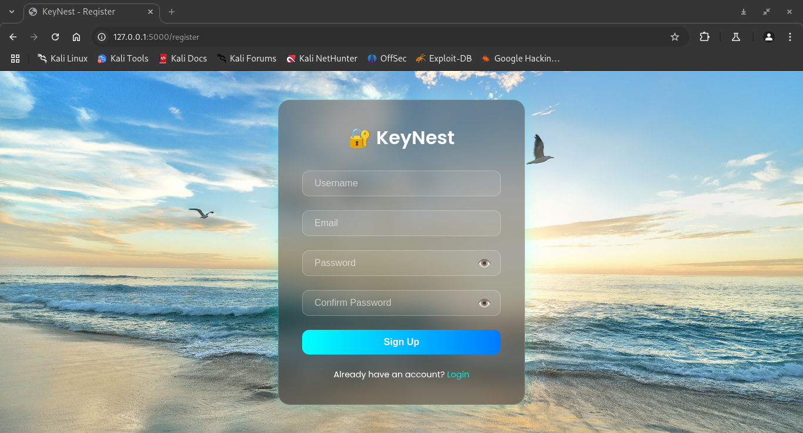
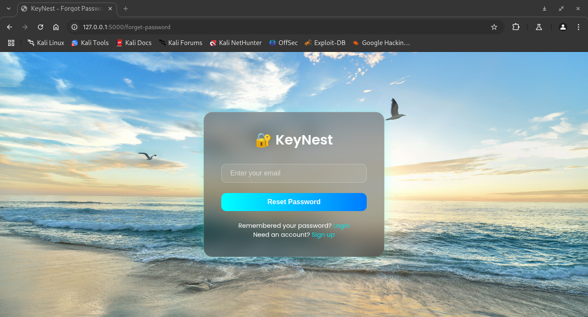

# 🔐 KeyNest – Password Manager

KeyNest is a secure, beginner-friendly password manager built with Flask. It provides essential authentication features like user registration, login, email verification, and password reset — wrapped in a modern glassmorphism UI.

---

## 🚀 Features

- User registration with email verification  
- Login with username or email  
- Forgot password and reset via email token  
- Passwords securely hashed using bcrypt  
- Session management and access control  
- Frosted glass-inspired UI for authentication pages  
- Environment-secured API keys and credentials

---

## 🖼️ Screenshots

### 🔑 Login Page


### 🧾 Registration Page


### 🔄 Reset Password Page


---

## 📁 Project Structure

keynest/
├── app/
│ ├── static/
│ ├── templates/
│ ├── routes.py
│ ├── forms.py
│ ├── models.py
│ └── ...
├── run.py
├── requirements.txt
├── README.md
└── .gitignore

yaml
Copy
Edit

---

## 🛠️ Setup

```bash
# 1. Clone repository
git clone git@github.com:Samuel-pwd/Keynest.git
cd Keynest

# 2. Create virtual environment
python3 -m venv venv
source venv/bin/activate

# 3. Install dependencies
pip install -r requirements.txt

# 4. Configure .env with your credentials
SECRET_KEY=your_secret_key
MAIL_USERNAME=your_email
MAIL_PASSWORD=your_email_password_or_brevo_key

# 5. Run the app
python run.py
✍️ Author
Otieno Samuel
GitHub: @Samuel-pwd

📌 Notes
This project documents growth from scratch — including screenshots at key milestones.

Secrets are protected using .env and .gitignore.

The project will evolve into a secure, production-ready tool.

📜 License
This project is released under the MIT License.

yaml
Copy
Edit

---

✅ Paste this directly into your `README.md`, save, and push:

```bash
git add README.md
git commit -m "Add professional README with screenshots and credits"
git push
